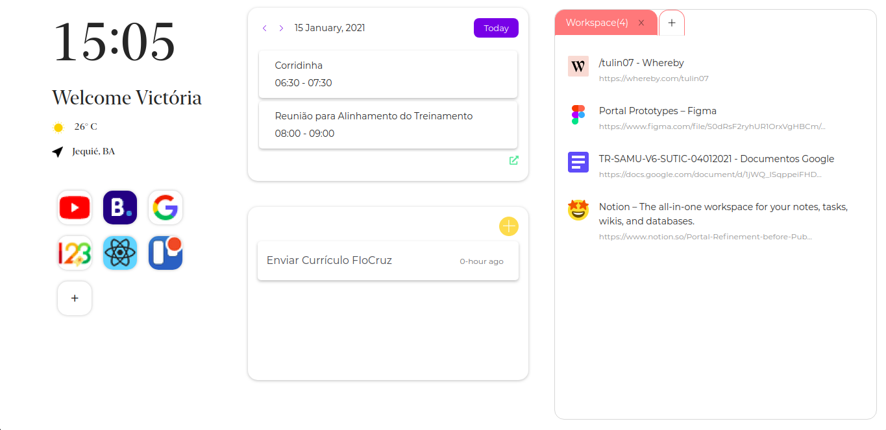

<div align="center">

# 💻 Papo Portal



</div>

## 📖 About

- Papo Papo is a tool for managing tabs and internet content. Now you can easily navigate between workspaces and your favorite sites. Use Chat as your home page, and have access to your appointments and notes in a simple and uncomplicated way. Take control of your navigation with Papo Portal

## :white_check_mark: How to Install

Install [nodejs] (https://nodejs.org/en/) (used nvm on the server).

Clone the project:

```bash
git clone https://github.com/Privoce/Portal.git
```

Enter the project folder:

```bash
cd Portal
```

Install the project dependencies:

```bash
npm i
#or
yarn
```

## ⚠️ Important

- Use only `npm` or` yarn`, never both!
- If there is `package-lock.json` and` yarn-lock.json` (`package.json` is totally different from` package-lock.json`) there will be an error in npm by using two dependency managers, delete one .

## :white_check_mark: To run the application in your browser you must:

- Go to More Tools -> Extensions
- Click on Load Unpacked and download the Build file
- Install and extension and you're ready to go!

### For more internet solutions and data management, visit privoce.com and see our products.
